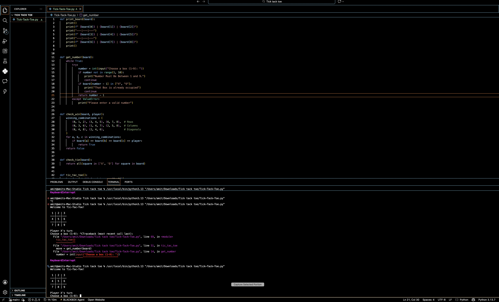

# Tic Tac Toe

A simple Tic Tac Toe game made in Python as part of a Hack Club project.

## Demo

https://github.com/colpie34/Tick-Tack-Toe-/releases/tag/v1.0

## Screenshot



## Features

- Two-player gameplay
- Win detection
- Draw detection
- Console-based interface
- Play again option

## How to Run

1. Install Python 3.
2. Download or clone this repository.
3. Open a terminal in the project folder.
4. Run:

```bash
python Tick-Tack-Toe.py
```

## About

I created this project as part of a Hack Club project. While building it, I learned about Python functions, loops, conditionals, user input, and game logic. It was a fun project that helped me improve my programming skills and understand how games work.

## Video Demo

https://www.youtube.com/watch?v=TlPWSnDsQr4

## Author

Created by colpie34.
